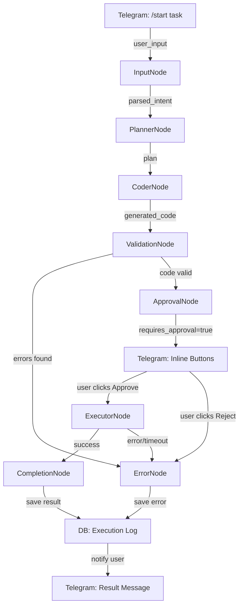
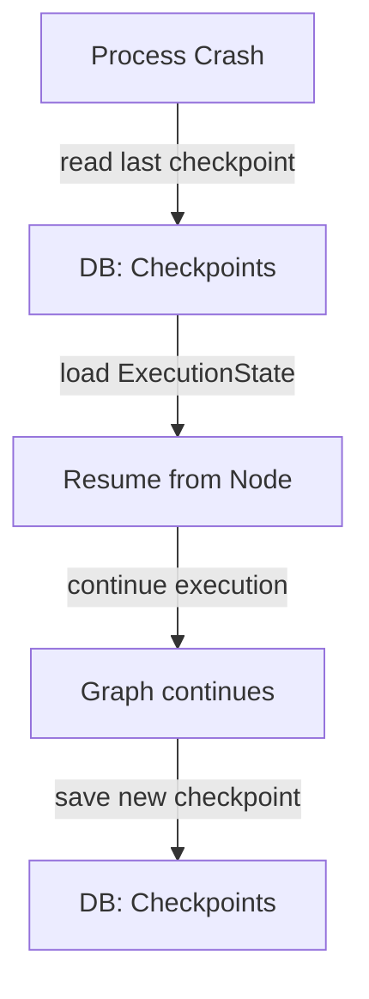
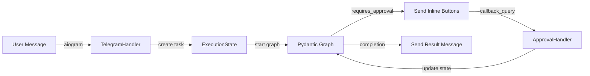
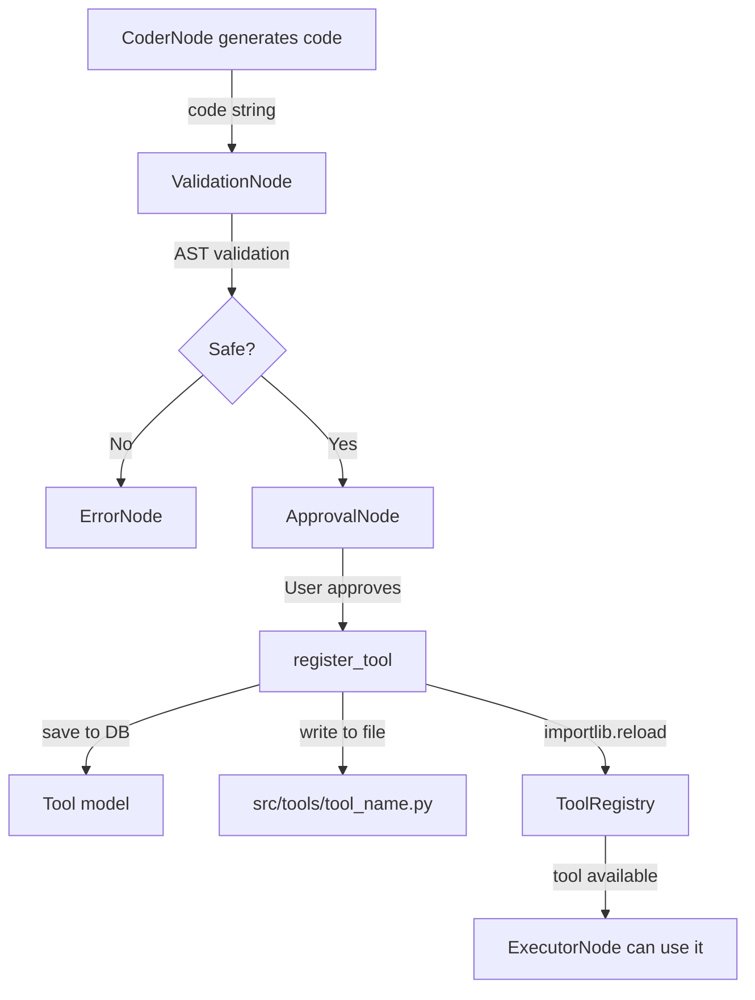

# 5. Диаграмма Потока Данных

## Основной Поток Выполнения



## Восстановление из Checkpoint



## Интеграция с Telegram



## Жизненный Цикл Инструмента



## Состояние в БД

```
Task (user_id, status, created_at)
  ├── Checkpoints (node_name, state_data, created_at)
  │   └── state_data = JSON(ExecutionState)
  ├── Executions (tool_id, status, result, duration_ms)
  └── Approvals (action_type, action_data, status)

Tool (name, code, version, created_at)
  └── Executions (task_id, status, result)
```

## Сценарий: Самоэволюция

```
1. User: "Создай инструмент для парсинга JSON"
   ↓
2. InputNode парсит intent
   ↓
3. PlannerNode создает план
   ↓
4. CoderNode генерирует код функции parse_json()
   ↓
5. ValidationNode проверяет безопасность
   ↓
6. ApprovalNode отправляет Inline-кнопки в Telegram
   ↓
7. User нажимает "Approve"
   ↓
8. register_tool() сохраняет в БД и файловую систему
   ↓
9. ToolRegistry перезагружает модуль
   ↓
10. ExecutorNode тестирует инструмент
    ↓
11. Инструмент готов к использованию в будущих задачах
```

## Таймауты и Ограничения

| Компонент | Таймаут | Лимит |
|-----------|---------|-------|
| Pydantic AI запрос | 60s | 3 попытки |
| Код в sandbox | 30s | 1 выполнение |
| Граф выполнение | 300s | 1 попытка |
| Одобрение от пользователя | 3600s | ∞ |

---

**Архитектурный план завершен. Ожидаю вашего подтверждения.**
